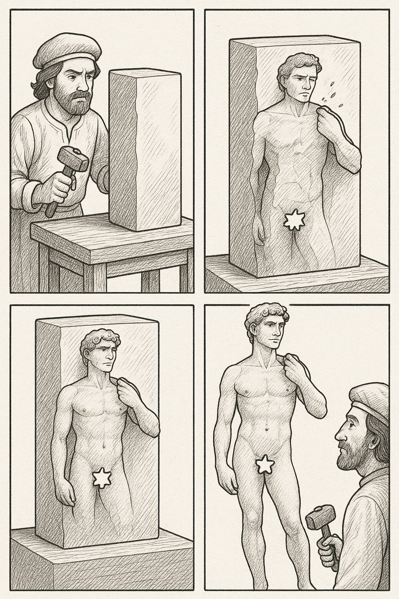
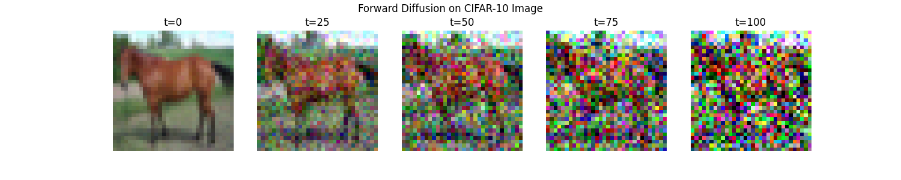

# 🧠 Diffusion Policy Tutorials: MNIST & CIFAR-10


> A minimal, reproducible tutorial for learning diffusion policies — with two runnable examples:  
> 
> - ✨ **MNIST** (Lightweight) — Runs on entry-level GPUs or CPUs, using a minimal UNet architecture for grayscale digit generation.
> - 💥 **CIFAR-10 (Full)** — Runs on GPUs, using a deeper UNet architecture for color image generation.

A glimpse of the two tutorials:
* MNIST: 
* CIFAR-10:
    
## 🚀 1. Introduction

This tutorial demonstrates how to build a Diffusion Policy from scratch using PyTorch.
We start with a simple grayscale example on MNIST, then extend it to a larger UNet and CIFAR-10.

You’ll learn:

* The basics of diffusion models (forward noise / reverse denoising)

* How to implement a UNet backbone for diffusion

* How to train and sample from diffusion models on MNIST and CIFAR-10

## ⚙️ 2. Setup
```
git clone https://github.com/yourname/diffusion-tutorial.git
cd diffusion-tutorial
conda create -n diffusion python=3.10
pip install -r requirements.txt
```
## 🧩 3. About Diffusion
> Every block of stone has a statue inside it, and it is the task of the sculptor to discover it.       - Michelangelo

### 3.1 How do we dig out image from noise?
In the same vein, consider a blurry or noisy image as an uncarved stone, from which we gradually dig out the true image step by step.
### 3.2 Forward Pass
In order to *"dig out"* the image, we first have to learn how to rebuild the uncarved stone.

$q(x_t \mid x_{t-1}) = \mathcal{N}\!\left(x_t; (1 - \beta_t)x_{t-1}, \beta_t I\right)$

- $x_0$: Original (clean) data sample  
- $x_t$: Noisy sample at step $t$  
- $\beta_t$: Variance (noise level) at step $t$  
- $I$: Identity matrix


Because the forward process is Gaussian and Markov, all the noise additions are linear and independent.
 - Linear combination of Gaussian(Normal distribution) is still Gaussian.
 - A Markov process means that the next state depends only on the current state, not on any earlier ones.


$$
q(x_t \mid x_0) 
= \mathcal{N}\!\left(x_t;\, \sqrt{\bar{\alpha}_t}\,x_0,\; (1 - \bar{\alpha}_t) I \right),
$$

$$
\text{where} \quad 
\bar{\alpha}_t = \prod_{i=1}^{t} (1 - \beta_i).
$$

$$
x_t = \sqrt{\bar{\alpha}_t}\,x_0 + \sqrt{1 - \bar{\alpha}_t}\,\epsilon, 
\quad \epsilon \sim \mathcal{N}(0, I)
$$


### 3.3 Reverse Pass
We will have the model learning this process, but reversely.

### 3.4 UNet(But not necessarily has to be)


But in general, all generative model could work, e.g. DiT.
## 💪 4. Get your hands dirty
```
git clone https://github.com/Jas000n/diffusion-tutorial.git
cd diffusion-tutorial
pip install -r requirements.txt
```
#### 4.1 MNIST Tutorial (Lightweight)
> 💡 For users with entry level GPU or without a GPU, or if you just want to understand the diffusion core idea.
```
cd MNIST
python main.py
```
See the diffision process:
```
python visual.py
```


#### 4.2 CIFAR-10 Tutorial (Full Version)
> ⚡️ For users with a high end GPU — this version trains a larger UNet on color images.
```
cd CIFAR10
python main.py
```
See the diffision process:
```
python visual.py
```

## Last but not least

Everything is a Distribution! Diffusion models are not limited to generating images, they learn **distributions**.  
That means: *anything that can be represented as data can be modeled as a diffusion process.*
### 🤖 Robot Motion Generation
### 🏠 Interior Design Generation
### 🎶 Music or Audio Generation
### 🧬 Molecular & Protein Design